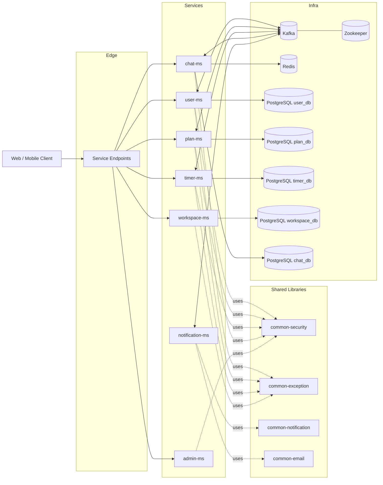

# Sonbuc Backend Monorepo

Sonbuc is a microservices-based backend monorepo for a personal productivity platform.
It includes services for user authentication, plans/goals, timer notes, workspaces,
real-time chat, notifications, and admin-level statistics.

## Highlights

- Domain-driven microservice separation
- JWT-based authentication and role-based authorization
- Event-driven inter-service communication with Kafka
- Real-time messaging with WebSocket/STOMP
- PostgreSQL persistence across services
- Redis integration for chat-related workflows
- Docker Compose-based local orchestration

## Architecture Diagram



## Repository Structure

```text
com.sonbuc/
├── docker-compose/         # Local environment orchestration (Kafka, DBs, services)
├── user-ms/                # User, auth, OTP, password flows
├── plan-ms/                # Plans, goals, sharing, rank/statistics
├── timer-ms/               # Timer/time-note management
├── workspace-ms/           # Workspace management
├── chat-ms/                # Real-time chat (WebSocket)
├── notification-ms/        # Email/notification consumer service
├── admin-ms/               # Centralized statistics and admin APIs
├── common-security/        # Shared security utilities
├── common-exception/       # Shared exception handling utilities
├── common-notification/    # Shared notification DTOs/utilities
└── common-email/           # Shared email sender utilities
```

## Architecture Notes

- Each service is responsible for a bounded domain.
- Inter-service flows use both REST and Kafka events.
- `common-*` modules reduce duplication and centralize shared concerns.
- `docker-compose/docker-compose.yml` is the main local runtime entry point.

## Technology Stack

- **Java 17**
- **Spring Boot 2.7.x**
- Spring Security, Spring Data JPA, Spring Validation
- Spring Kafka
- PostgreSQL
- Redis
- WebSocket/STOMP (SockJS)
- Docker & Docker Compose
- Gradle

## Quickstart (Local)

> Prerequisites: Docker, Docker Compose, Java 17

### 1) Start local infrastructure and configured services

```bash
cd docker-compose
docker compose up -d --build
```

### 2) Check container/service status

```bash
docker compose ps
```

### 3) Example local endpoints

- User service: `http://localhost:8080`
- Notification service: `http://localhost:8082`
- Kafka UI: `http://localhost:9090`

> Note: Some services are currently commented out in `docker-compose.yml`.
> Enable them when needed for local development.

## Running Services Individually

You can run a service directly with its Gradle wrapper:

```bash
cd user-ms
./gradlew bootRun
```

Use the same pattern for other `*-ms` directories.

## Security Notes

- JWT validation and role-based access control are enabled.
- Rate limiting is implemented in selected services.
- Development defaults may exist; production deployments should apply hardening.

## Event-Driven Flow Examples

Typical Kafka-driven workflows in this project:

- User invite and shared-plan announcements
- Plan/goal status updates
- Plan item / container text synchronization
- Timer-to-plan connection updates
- Account confirmation, password reset, and OTP email notifications

## Contribution Guide

1. Create a feature branch.
2. Keep commits focused and meaningful.
3. Validate your service-level changes before opening a PR.
4. In PR descriptions, mention affected services and config/migration impact.

## License

A project license has not been added yet.
If this repository will be open-sourced, add a `LICENSE` file.
